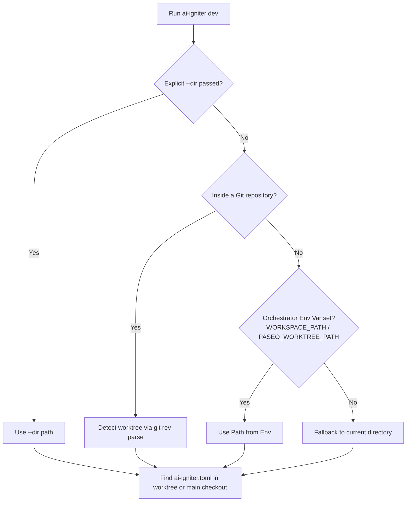

# 🔍 Workspace Resolution & Port Allocation

`ai-igniter` is designed to work seamlessly in two different modes:
1. **Standalone Mode (Zero-Config Git Worktrees):** Pure Git, no external tools or orchestrators required.
2. **Orchestrator Mode:** Integrated with AI dev tools like **Paseo**, **Conductor**, **Orca**, or custom workspace managers.

This document details how `ai-igniter` determines which workspace you are in, isolates Docker containers, and allocates unique ports without collisions.

---

## 1. How Workspaces are Resolved

When you run `ai-igniter dev` (or any other command), `ai-igniter` follows a strict resolution hierarchy to determine:
- **`workspace_path`**: The current worktree / directory you are working in.
- **`root_path`**: The main repository root (used for one-time file seeding via `copy_files`).
- **`config_path`**: The location of `ai-igniter.toml`.



### Resolution Order

1. **Explicit Flag (`--dir <PATH>`)**: Takes top priority if specified.
2. **Native Git Inspection (Standalone Mode)**:
   - `ai-igniter` runs `git rev-parse --show-toplevel` to identify the current directory or git worktree.
   - It runs `git rev-parse --git-common-dir` to identify the **main checkout** of the repository.
   - It looks for `ai-igniter.toml` inside the worktree; if not present (e.g. untracked branch), it automatically falls back to reading it from the main checkout!
3. **Orchestrator Environment Variables**:
   - If invoked from outside any git repository, it checks `WORKSPACE_PATH`, `PASEO_WORKTREE_PATH`, `CONDUCTOR_WORKSPACE_PATH`, or `ORCA_WORKSPACE_PATH`.

### 🛡️ Anti-Hijacking Protection
When working with AI agents or multiple terminal sessions, environment variables (like `PASEO_WORKTREE_PATH`) often leak across processes.
`ai-igniter` **never allows environment variables to hijack a command run inside a git repository**. Local filesystem context always takes precedence.

---

## 2. Docker Isolation (`compose_project`)

To prevent multiple worktrees from sharing or overwriting each other's containers, networks, or volumes:

1. A **slug** is extracted from the worktree folder name (e.g., `feature-auth`).
2. A **hash** (4 bytes hex) is computed from the absolute path of the workspace (e.g., `8f12a4bc`).
3. The Docker Compose project name is assigned as:
   ```
   {project_name}-{slug}-{hash}
   ```
   *Example:* `my-app-feature-auth-8f12a4bc`

This ensures that even if you have two worktrees with the same folder name in different parent directories, their Docker containers and volumes remain 100% isolated.

---

## 3. Dynamic Port Allocation

Every worktree needs unique ports to avoid the infamous `bind: address already in use` error.

### Base Port Calculation

The primary application port (`{{ports.base}}`) is resolved using the following priority:

| Priority | Source | Description |
| :--- | :--- | :--- |
| **1** | `--port <PORT>` | Explicit CLI override |
| **2** | `[orchestrator].port_env` | Environment variable declared in TOML (e.g., `PASEO_PORT`) |
| **3** | Generic Env Vars | `$WORKSPACE_PORT`, `$PASEO_PORT`, `$CONDUCTOR_PORT` |
| **4** | `base_port` (in TOML) | Optional fixed port in `ai-igniter.toml` |
| **5** | **Path-derived Hash** | **Default:** Deterministic port in range `20000..=59980` in steps of 20 |

### Deterministic Port Derivation (Standalone Mode)
Without any configuration or external orchestrator, `ai-igniter` takes the SHA-256 hash of your worktree's canonical path:
```rust
base_port = 20000 + (hash_u16 % 2000) * 20
```
- **Stable:** Running `ai-igniter dev` in the same worktree tomorrow will allocate the exact same port.
- **Spaced:** Each worktree receives a 20-port buffer (e.g., `20040` to `20059`) allowing for multiple services without overlapping with another worktree.

### Service Port Offsets
Each service declared in `ai-igniter.toml` defines a `port_offset`:
$$\text{Service Port} = \text{Base Port} + \text{port\_offset}$$

*Example with Base Port `24120`:*
- App Port: `24120` (`ports.base`)
- PostgreSQL (`port_offset = 1`): `24121` (`ports.postgres`)
- Garage S3 (`port_offset = 3`): `24123` (`ports.garage`)
- Garage Web (`web_port_offset = 4`): `24124` (`ports.garage_web`)
- Mailpit (`port_offset = 8`): `24128` (`ports.mailpit`)

---

## 4. Port Conflict Reclaiming

What if another branch was stopped improperly and still holds your allocated port?

Before starting services:
1. `ai-igniter` checks if any running container is listening on the target ports.
2. If the container is labeled with `ai-igniter.managed=true` (belonging to another `ai-igniter` workspace):
   - It runs `docker compose down` on that specific inactive workspace.
   - **Volumes are preserved**, so you don't lose data when returning to that workspace later.
3. If the conflicting container was **not** created by `ai-igniter`, it is left untouched and a warning is displayed.

---

## 5. File Seeding (`copy_files`)

When initializing a new worktree, it often lacks local secrets or uncommitted configuration files.

```toml
copy_files = [
  { from = ".env", to = ".env.local" },
  ".env.test"
]
```

- When `ai-igniter dev` runs in a new worktree, it copies the declared files from the `root_path` (main checkout) to the `workspace_path`.
- **Idempotent:** Files are only copied if the destination file does not already exist. It will never overwrite modified worktree files.
