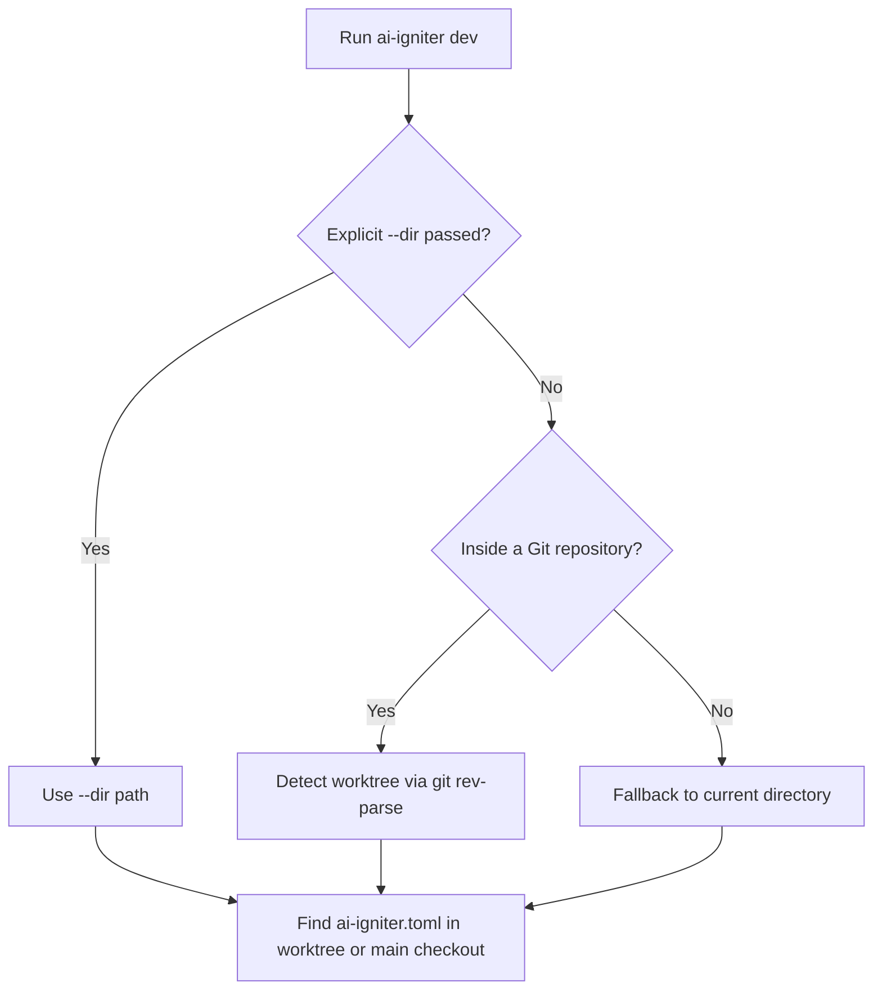

# 🔍 Workspace Resolution & Port Allocation

`ai-igniter` is designed to be **100% zero-config and harness-agnostic**. It operates using native Git inspection and deterministic port allocation, requiring zero special environment variables.

This document details how `ai-igniter` determines which workspace you are in, isolates Docker containers, and allocates unique ports without collisions.

---

## 1. How Workspaces are Resolved

When you run `ai-igniter dev` (or any other command), `ai-igniter` follows a clean hierarchy to determine:
- **`workspace_path`**: The current worktree / directory you are working in.
- **`root_path`**: The main repository root (used for one-time file seeding via `copy_files`).
- **`config_path`**: The location of `ai-igniter.toml`.


```mermaid
flowchart TD
    A[Run ai-igniter dev] --> B{Explicit --dir passed?}
    B -- Yes --> C[Use --dir path]
    B -- No --> D{Inside a Git repository?}
    D -- Yes --> E[Detect worktree via git rev-parse]
    D -- No --> F[Fallback to current directory]
    E --> G[Find ai-igniter.toml in worktree or main checkout]
    C --> G
    F --> G
```

### Resolution Order

1. **Explicit Flag (`--dir <PATH>`)**: Takes top priority if specified.
2. **Native Git Inspection**:
   - `ai-igniter` runs `git rev-parse --show-toplevel` to identify the current directory or git worktree.
   - It runs `git rev-parse --git-common-dir` to identify the **main checkout** of the repository.
   - It looks for `ai-igniter.toml` inside the worktree; if not present (e.g. untracked branch), it automatically falls back to reading it from the main checkout!
3. **Current Directory**: Fallback if running outside of any git repository.

### Root Path Resolution Order
1. `--root <PATH>` CLI override
2. Git main checkout (`git rev-parse --git-common-dir`)
3. Fallback to `workspace_path`

### Local Overrides (`ai-igniter.local.toml`)
To support machine-specific port or dev command settings without dirtying git:
- `ai-igniter` automatically loads and deep-merges `ai-igniter.local.toml` (or `.ai-igniter.local.toml`) if present.
- It checks the workspace directory first, then the root checkout directory.
- `ai-igniter init` automatically ensures `*.local.toml` is added to `.gitignore`.

---

## 2. Docker Isolation (`compose_project`)

To prevent multiple worktrees from sharing or overwriting each other's containers, networks, or volumes:

1. A **slug** is extracted from the worktree folder name (e.g., `feature-auth`).
2. A **hash** (4 bytes hex) is computed from the absolute path of the workspace (e.g., `8f12a4bc`).
3. The Docker Compose project name is assigned as:
   ```
   {project_name}-{slug}-{hash}
   ```
   *Example:* `my-app-feature-auth-8f12a4bc`

This ensures that even if you have two worktrees with the same folder name in different parent directories, their Docker containers and volumes remain 100% isolated.

---

## 3. Dynamic Port Allocation

Every worktree needs unique ports to avoid the infamous `bind: address already in use` error.

### Base Port Calculation

The primary application port (`{{ports.base}}`) is resolved using the following priority:

| Priority | Source | Description |
| :--- | :--- | :--- |
| **1** | `--port <PORT>` | Explicit CLI override |
| **2** | `base_port` (in TOML) | Optional fixed port in `ai-igniter.toml` or `ai-igniter.local.toml` |
| **3** | **Path-derived Hash** | **Default:** Deterministic port in range `20000..=59980` in steps of 20 |

> **Collision-Free Guarantee:** If the configured or derived base port is already in use by another process on your host, `ai-igniter` automatically detects it and steps forward to the next available TCP port.

### Deterministic Port Derivation
Without any configuration, `ai-igniter` takes the SHA-256 hash of your worktree's canonical path:
```rust
base_port = 20000 + (hash_u16 % 2000) * 20
```
- **Stable:** Running `ai-igniter dev` in the same worktree tomorrow will allocate the exact same port (preserving your browser cookies, local storage, and bookmarks).
- **Spaced:** Each worktree receives a 20-port buffer (e.g., `20040` to `20059`) allowing for multiple services without overlapping with another worktree.

### Service Ports (Zero-Conflict Independence)
Each service declared in `ai-igniter.toml` defines an offset (e.g. `port_offset = 1` for Postgres, `port_offset = 3` for Garage).
- **Preferred Port:** `base_port + port_offset`.
- **Dynamic Conflict Avoidance:** Unlike rigid tools, if another process on your machine is squatting the exact offset port, `ai-igniter` **automatically allocates an independent free port** from the OS for that service!
- Since services are consumed through template variables (`DATABASE_URL`, `S3_ENDPOINT`), your application connects seamlessly without any port collision errors.

---

## 4. Port Conflict Reclaiming

What if another branch was stopped improperly and still holds your allocated port?

Before starting services:
1. `ai-igniter` checks if any running container is listening on the target ports.
2. If the container is labeled with `ai-igniter.managed=true` (belonging to another `ai-igniter` workspace):
   - It runs `docker compose down` on that specific inactive workspace.
   - **Volumes are preserved**, so you don't lose data when returning to that workspace later.
3. If the conflicting container was **not** created by `ai-igniter`, it is left untouched and a warning is displayed.

---

## 5. File Seeding (`copy_files`)

When initializing a new worktree, it often lacks local secrets or uncommitted configuration files.

```toml
copy_files = [
  { from = ".env", to = ".env.local" },
  ".env.test"
]
```

- When `ai-igniter dev` runs in a new worktree, it copies the declared files from the `root_path` (main checkout) to the `workspace_path`.
- **Idempotent:** Files are only copied if the destination file does not already exist. It will never overwrite modified worktree files.
